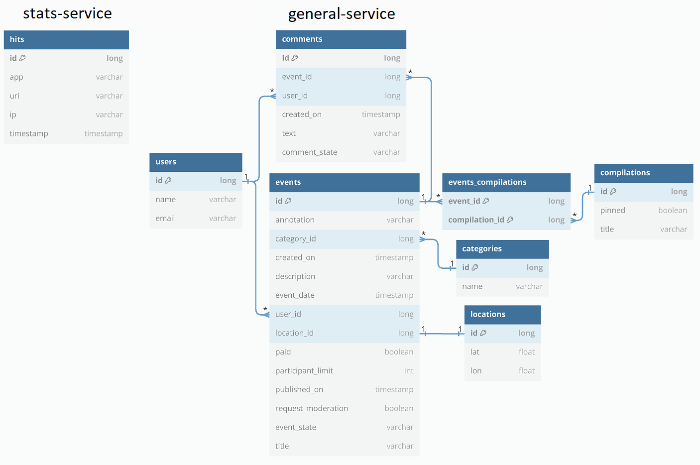

[](https://www.midjourney.com)
# Explore with me - сервис поиска компании для совместного времяпровождения
[](https://www.oracle.com/java/)
[](https://spring.io/projects/spring-framework) 
[](https://www.postgresql.org/)
[](https://hibernate.org/)
[](https://maven.apache.org/)
[](https://www.docker.com/)
[](https://www.postman.com/)
[](https://editor-next.swagger.io/)

## Описание
Explore with me дословно переводится как исследуй со мной. Приложение предоставляет возможность делиться информацией об интересных событиях и помогает найти компанию для участия в них

## Архитектура
Приложение состоит из 2 микросервисов:
- general-service бизнес-логика приложения
- stats-service - сбор статистики просмотров

Микросервисы и базы данных к ним запускаются в отдельных docker-контейнерах.


## Функциональность
Поведение приложения различается для администраторов (admin), незарегистрированных (public) и зарегистрированных (private) пользователей. Подробное описание эндпоинтов, классов и требований к ним приведены в спецификации Swagger:
- [сервис статистики](https://app.swaggerhub.com/apis/KonstantinOsipov/stat-service_api/v0)
- [основной сервис](https://app.swaggerhub.com/apis/KonstantinOsipov/explore-with_me_api/1.0)
## Диаграммы базы данных для 2 микросервисов


## Как запустить и использовать
Для запуска необходимо, чтобы на ПК была установлена и открыта программа [Docker Desktop](https://www.docker.com/products/docker-desktop/). После установки откройте командную строку cmd и выполните следующие команды

   ```
git clone https://github.com/OsipovKonstantin/java-explore-with-me.git
   ```
в командной строке перейдите в корень проекта. Затем:
   ```
mvn clean package
   ```
   ```
docker-compose up
   ```
Приложение готово к использованию! Сервис статистики доступен по андресу [http://localhost:9090](http://localhost:9090), а основной сервис - [http://localhost:8080](http://localhost:8080)

Со сценариями работы приложения можно ознакомиться, запустив коллекции Postman-тестов:
- [сервис статистики](postman/stats-service.json)
- [основной сервис](postman/general-service.json)
